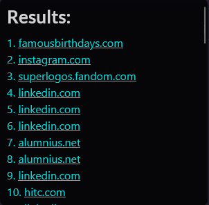

# FaceCheck.id result metadata exposure

> [!IMPORTANT]
> **Resolved / historical proof of concept.** FaceCheck.id has changed its
> implementation and the exposure documented here is no longer reproducible.
> The userscript is retained as a record of the original finding and the
> subsequent open-source collaboration; it is not an actively supported tool.

This repository documents a client-side data-exposure issue that affected
FaceCheck.id search results. Source URLs that were not shown directly in the
interface were still delivered to the browser inside metadata embedded in
base64-encoded WebP images. The proof-of-concept userscript extracted those URLs
and displayed them alongside the associated confidence score.

## Security finding

The affected implementation sent source URLs to the client before determining
whether the user should be able to view them. Because client-delivered data
cannot be made secret by hiding it in the interface, the URLs remained
recoverable from the image metadata.

This was documented as an **OWASP Top 10 A01:2021 — Broken Access Control**
finding: the sensitive field reached an unauthorized client instead of being
withheld server-side. It can also be described more generally as unintended
information exposure through embedded metadata.

### Observed flow

```text
search response
    -> base64-encoded WebP result image
    -> embedded XMP metadata
    -> source URL recovered in the browser
    -> URL shown by the userscript
```

### Impact

- Source pages associated with facial-search results could be disclosed.
- Those pages could contain social profiles or other identifying information.
- Removing a link from the interface did not prevent a client from recovering
  data that had already been delivered.

### Recommended mitigations

- Remove XMP, EXIF, and other unnecessary metadata before serving images.
- Do not place sensitive fields in client-delivered assets or responses.
- Apply authorization checks server-side before returning protected data.
- Add regression tests that inspect generated assets as well as visible API
  fields.

See [OWASP A01:2021 — Broken Access Control][owasp-a01] for the broader control
category.

## Proof of concept

[`facecheck-id-results-exposure-poc.user.js`](facecheck-id-results-exposure-poc.user.js)
is the final combined desktop/mobile userscript (version 3.0.0). At the time of
the finding it:

- located FaceCheck.id result-image elements;
- decoded their base64 image data in the browser;
- recovered embedded HTTP(S) source URLs;
- grouped related results and displayed their confidence scores;
- supported hover interactions on desktop and tap overlays on mobile.

The implementation depended on FaceCheck.id's then-current DOM structure and
response format. It is therefore intentionally preserved as a historical PoC,
not adapted to the site's current implementation.

### Historical output

The screenshot below shows output from an earlier desktop version. The listed
domains are retained only as a technical example; they do not establish that
the underlying facial matches were correct.



## Responsible-use boundary

The project was created for security research and responsible disclosure.
FaceCheck.id was contacted through publicly available channels about the
finding. The affected behavior has since been fixed.

Do not use facial-search data for harassment, doxing, stalking, or other
privacy-invasive activity. Anyone reproducing security research must have a
lawful basis, respect applicable terms and privacy rights, minimize collected
personal data, and avoid publishing data belonging to real individuals.

## Limitations

- The PoC demonstrated exposure in a historical implementation only.
- URL relevance and confidence scores originated from FaceCheck.id and were not
  independently validated by this project.
- The script parsed client-side presentation data; it did not access
  FaceCheck.id's servers beyond normal browser-delivered responses.
- No claim is made about the site's current architecture or controls.

## License

The code is available under the [GNU General Public License v3.0](LICENSE).

[owasp-a01]: https://owasp.org/Top10/A01_2021-Broken_Access_Control/
